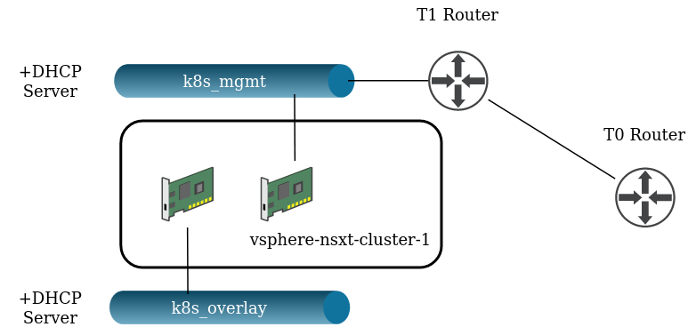
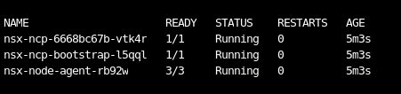

# NSX-T POC Terraform Script

## About

This script is intended to proof of concept/test the NSX-T container networking interface for Kubernetes. It does so by spinning up a single node, K8s Cluster from Rancher and applying the NSX-T manifest.

---

## Requirements

NSX-T needs to be configured in an existing vSphere environment, including:

* T0 Router
* Transport Zones for North-West and East-West traffic
* Edge cluster

---

## How to use - Including caveats (to be addressed)

This script assumes the following:

* First Ethernet interface is ens160 (Management)
* Second Ethernet interface is ens192 (Overlay)
* The template to clone from has `Python` installed and `cloud-init` is in a reset state
* NSX-T has some strict requirements pertaining to OS and Kernel versions, these need to be met (https://docs.vmware.com/en/VMware-NSX-T-Data-Center/2.5/rn/NSX-Container-Plugin-251-Release-Notes.html).
* Until the ability to tag specific interfaces is implemented in the NSX-T terraform provider (https://github.com/terraform-providers/terraform-provider-nsxt/issues/248) **You must, after the script has run, go into NSXT -> Advanced > Inventory > Virtual Machines > vSphere-NSXT-Cluster-1, select the logical port corresponding to the 10.80.80.10 address -> Remove tags**. Only the overlay port needs to be tagged, having both will cause the install to fail.
* NSXT NCP container image is not public, and therefore you will need to put it in a container registry of your own

Populate the required terraform variables - leverage `terraform.tfvars.example` as a template.

---

## What this script does

At a high level, the sript provisions the following:

* Create overlay and management logical switches
* Create a T1 router for the management logical switch
* Connect the management T1 router to T0
* Create DHCP servers and profiles for both the management and overlay networks
* Tag the interfaces on the NSX-T VM
* Create the cloud credentials for Rancher
* Create the cluster in Rancher
* Populate and apply the NSX-T CNI YAML manifest

## Functionality

If everything has provisioned correctly, the corresponding NSX-T CNI pods will be running:

To which you can start leveraging for your Pod networking, provisioning `loadbalancer` service types, and everything else the CNI has to offer.